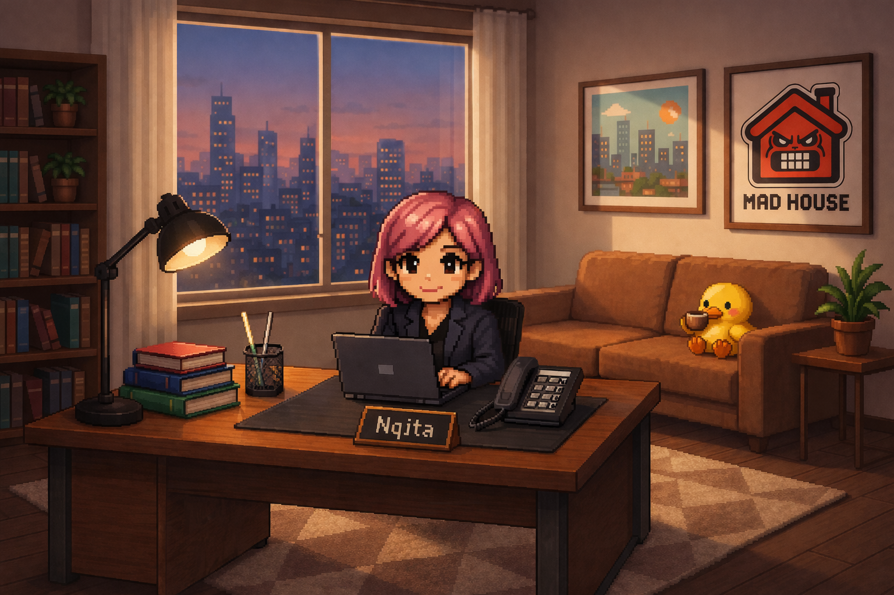
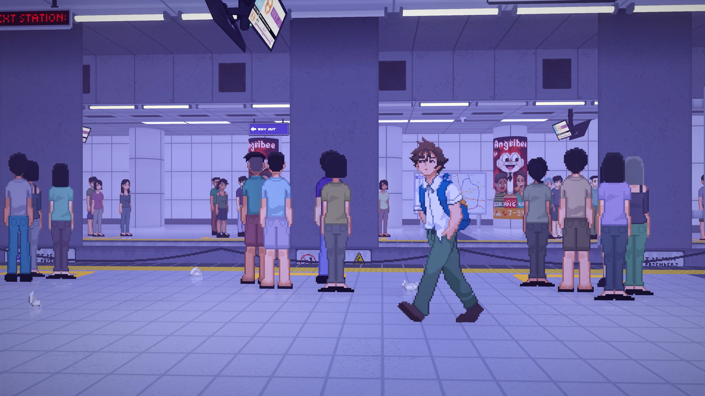

# wallpapers

**Personal wallpaper collection. Pixel art heavy.**

> [!NOTE]
> This README is auto-generated. All files are named `<palette>-<subject>-<nn>.ext` so you can sort by color or vibe at a glance.

## Showcase

<table>
  <tr>
    <td align="center"> nqita/nqita-office-pink-01.png</td>
    <td align="center"> ai-generated/teal-planet-animated-01.gif</td>
  </tr>
  <tr>
    <td align="center"> pixel-art/amber-sunset-river-01.png</td>
    <td align="center"> nqita/nqita-office-bodyguard-01.png</td>
  </tr>
  <tr>
    <td align="center"> ai-generated/blue-cathedral-cat-01.png</td>
    <td align="center"> pixel-art/purple-subway-station-01.jpeg</td>
  </tr>
</table>

## Categories

- [ai-generated](./ai-generated/)
- [nqita](./nqita/)
- [pixel-art](./pixel-art/)
