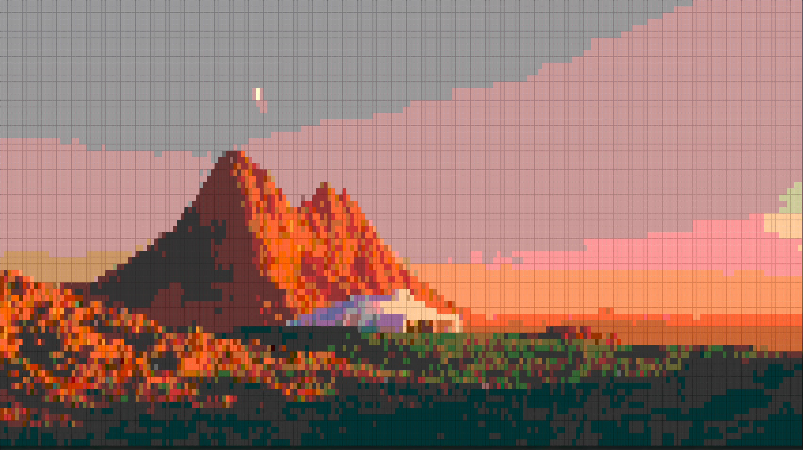
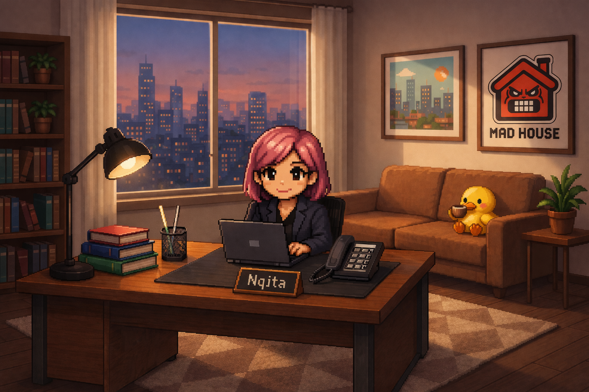
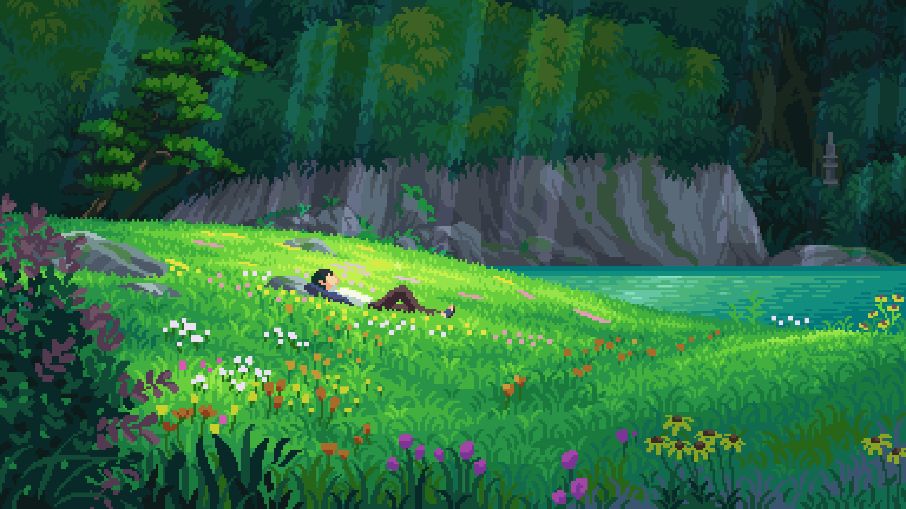
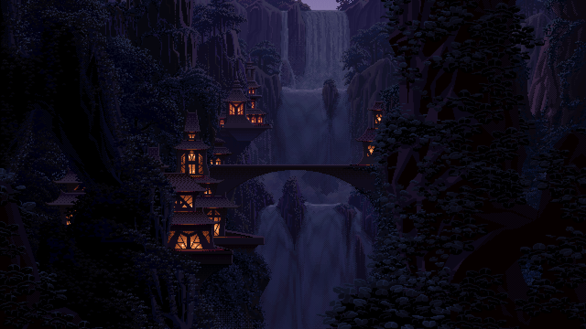
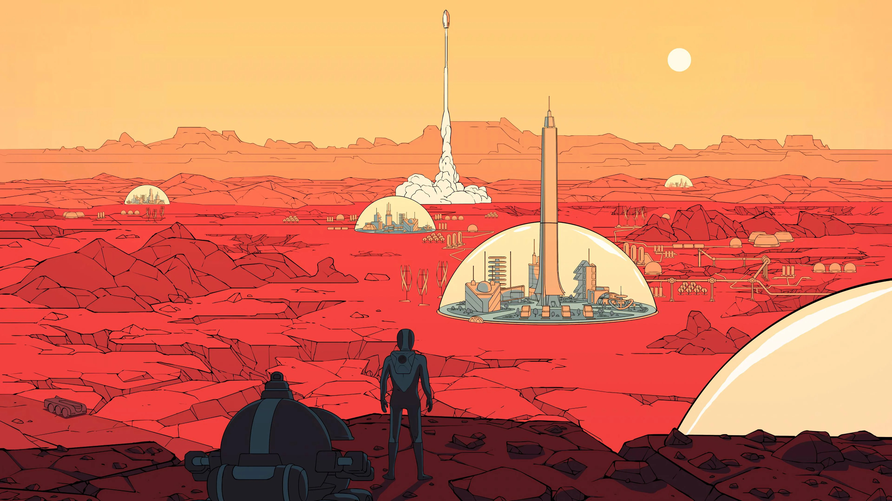

# wallpapers

**Personal wallpaper collection. Pixel art heavy.**

31 wallpapers • Latest update: May 4, 2026

> [!NOTE]
> This README is auto-generated. All files are named `<palette>-<subject>-<nn>.ext` so you can sort by color or vibe at a glance.

## Showcase

<table>
  <tr>
    <td align="center"> ascii-art/mono-ascii-02.png</td>
    <td align="center"> ai-generated/nqita-office-pink-01.png</td>
  </tr>
  <tr>
    <td align="center"> pixel-art/green-meadow-relaxing-01.jpg</td>
    <td align="center"> ai-generated/nqita-office-bodyguard-01.png</td>
  </tr>
  <tr>
    <td align="center"> pixel-art/dark-mountain-pagoda-01.jpg</td>
    <td align="center"> space/multi-spaceship-astronaut-01.jpg</td>
  </tr>
  <tr>
    <td align="center"> ascii-art/mono-ascii-01.png</td>
    <td></td>
  </tr>
</table>

## Categories

- [ai-generated](./ai-generated/)
- [ascii-art](./ascii-art/)
- [pixel-art](./pixel-art/)
- [space](./space/)
